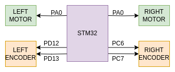

# CapyWheels
Part of the [Capybot](https://github.com/JorgePerC/TheLastOfThem) project. STM32 implementation of odometry and wheel control. 
Using the Nucleo-144 | STM32H745 board

# This project is based on:

[Rosserial for STM32 boards](https://github.com/yoneken/rosserial_stm32)

[Example of usage](https://github.com/xav-jann1/rosserial_stm32f4/blob/master/README.md#usage)

## Using rotary encoders

[Use timer as encoders](http://elastic-notes.blogspot.com/p/cubemx-stm32-encoder-interface.html)

[Another example](https://www.yashkudale.com/electronics/design-tips-use-peripherals-where-ever-possible/)

## Mixing C++ and C
[Simple tutorial](https://shawnhymel.com/1941/how-to-use-c-with-stm32cubeide/)
[Example Repo](https://github.com/BradenSunwold/stm32-hal-with-cpp/blob/main/Core/Src/CppBlinkPinout.cpp)
[Full explanation] (https://www.oracle.com/technical-resources/articles/it-infrastructure/mixing-c-and-cplusplus.html)

## Documentation-ish:

